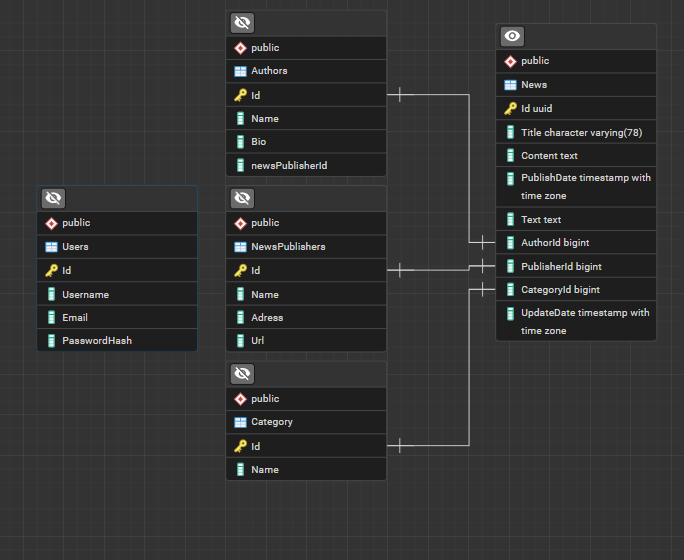

# Another News Platform

**Another News Platform** — это агрегатор новостей с автоматической оценкой тональности. Платформа собирает новости из RSS-источников, парсит их содержимое и оценивает "позитивность" каждой статьи с помощью LLM (Ollama).



---

## 🏗️ Архитектура

```
┌─────────────────────────────────────────────────────────────┐
│                    .NET Aspire (AppHost)                     │
│  ┌──────────────────────┐  ┌──────────────────────────────┐ │
│  │   Web API (REST)     │  │   MVC App (Server-side)      │ │
│  │   localhost:7238     │  │   localhost:7275             │ │
│  └──────────────────────┘  └──────────────────────────────┘ │
│  ┌─────────────────────────────────────────────────────────┐│
│  │               Angular Client (планируется)              ││
│  └─────────────────────────────────────────────────────────┘│
└──────────────────────────┬──────────────────────────────────┘
                           │
┌──────────────────────────┴──────────────────────────────────┐
│                    Service Layer                             │
│  ┌──────────────┐  ┌──────────────┐  ┌──────────────────┐  │
│  │ NewsService  │  │ UserService  │  │  TokenService    │  │
│  │ +Aggregation │  │ (BCrypt)     │  │  (JWT + Refresh) │  │
│  └──────┬───────┘  └──────┬───────┘  └──────────────────┘  │
└─────────┼─────────────────┼─────────────────────────────────┘
          │                 │
┌─────────┴─────────────────┴─────────────────────────────────┐
│                    CQRS (MediatR)                            │
│  ┌──────────────────────┐  ┌──────────────────────────────┐ │
│  │    Commands          │  │         Queries              │ │
│  │  - InsertArticle     │  │  - GetArticleById           │ │
│  │  - UpdateArticle     │  │  - GetArticleByPage         │ │
│  │  - InsertRate        │  │  - GetArticleByRateAndSource│ │
│  │  - RegisterUser      │  │  - GetLoginData             │ │
│  │  - CreateRefreshToken│  │  - VerifyUser               │ │
│  └──────────────────────┘  └──────────────────────────────┘ │
└──────────────────────────────┬──────────────────────────────┘
                               │
┌──────────────────────────────┴──────────────────────────────┐
│                    Database (PostgreSQL)                     │
│  ┌──────────┐  ┌──────────┐  ┌──────────┐  ┌────────────┐  │
│  │ Articles │  │ Sources  │  │  Users   │  │RefreshTokens│  │
│  │  +Rate   │  │  +RssUrl │  │  +Role   │  │            │  │
│  └──────────┘  └──────────┘  └──────────┘  └────────────┘  │
└─────────────────────────────────────────────────────────────┘
```

---

## 🧩 Состав решения (11 проектов)

| Проект | Назначение | Статус |
|--------|-----------|--------|
| [`AnotherNewsPlatform.WebApi`](AnotherNewsPlatform.WebApi/) | REST API с JWT-аутентификацией, Swagger, Hangfire | ✅ Готов |
| [`AnotherNewsPlatform.MVC`](AnotherNewsPlatform.MVC/) | ASP.NET Core MVC приложение с cookie-аутентификацией | ✅ Готов |
| [`anp-client`](anp-client/) | Angular 22 SPA с Taiga UI | 🚧 Планируется |
| [`AnotherNewsPlatform.Database`](AnotherNewsPlatform.Database/) | EF Core DbContext, сущности, миграции | ✅ Готов |
| [`AnotherNewsPlatform.CQRS`](AnotherNewsPlatform.CQRS/) | CQRS-команды и запросы (MediatR) | ✅ Готов |
| [`AnotherNewsPlatform.Core`](AnotherNewsPlatform.Core/) | DTO, мапперы (Mapperly), исключения | ✅ Готов |
| [`AnotherNewsPlatform.Services.ArticleService`](AnotherNewsPlatform.Services.ArticleService/) | Сервис новостей: RSS, парсинг, агрегация, рейтинг через Ollama | ✅ Готов |
| [`AnotherNewsPlatform.Services.UserService`](AnotherNewsPlatform.Services.UserService/) | Сервис пользователей: регистрация, логин, верификация | ✅ Готов |
| [`AnotherNewsPlatform.SourceService`](AnotherNewsPlatform.SourceService/) | Сервис источников новостей | 🚧 Планируется |
| [`AnotherNewsPlatform.TokenService`](AnotherNewsPlatform.TokenService/) | JWT + Refresh Token | ✅ Готов |
| [`AnotherNewsPlatform.AppHost`](AnotherNewsPlatform.AppHost/) | .NET Aspire оркестратор | ✅ Готов |
| [`AnotherNewsPlatform.ServiceDefaults`](AnotherNewsPlatform.ServiceDefaults/) | Общие настройки: OpenTelemetry, Health Checks, Hangfire, JWT | ✅ Готов |
| [`AnotherNewsPlatform.Tests`](AnotherNewsPlatform.Tests/) | xUnit тесты | 🚧 Планируется |

---

## 🔄 Пайплайн обработки новостей

```
RSS-источники (Onliner, Lenta, BT и др.)
       │
       ▼
  ┌─────────────┐     ┌─────────────────┐
  │  RssReader  │────▶│  WebScraper     │
  │  (Syndication│     │  (HtmlAgilityPack)│
  │   Feed)     │     │  + парсеры      │
  └─────────────┘     └────────┬────────┘
                               │
                    ┌──────────▼──────────┐
                    │  AggregateNewsJob   │  ← Hangfire (каждые 15 мин)
                    │  (сохранение в БД)  │
                    └──────────┬──────────┘
                               │
                    ┌──────────▼──────────┐
                    │  RateUnratedNewsJob │  ← Hangfire (каждый час)
                    │  (Ollama LLM)       │
                    │  Оценка от -10 до 10│
                    └──────────┬──────────┘
                               │
                    ┌──────────▼──────────┐
                    │  API / MVC / Angular│
                    │  Отображение новостей│
                    └─────────────────────┘
```

---

## 🚀 Быстрый старт

### Требования

- .NET 10 SDK
- Node.js 22+
- PostgreSQL 16+
- Ollama (опционально, для рейтинга)

### 1. База данных

```bash
# Строка подключения в appsettings.json:
# Server=127.0.0.1;Port=5432;Database=AnotherNewsPlatformDb;User Id=postgres;Password=rootroot

# Применить миграции
cd AnotherNewsPlatform.Database
dotnet ef database update
```

### 2. Backend

```bash
# Запуск через Aspire (рекомендуется)
dotnet run --project AnotherNewsPlatform.AppHost

# Или отдельно Web API
dotnet run --project AnotherNewsPlatform.WebApi
```

### 3. Angular-клиент (планируется)

```bash
cd anp-client
npm install
npm start
# Откроется на http://localhost:4200
```

### 4. Ollama (для рейтинга новостей)

```bash
# Установите модель (пример)
ollama pull lfm2.5-thinking:1.2b

# Настройка в appsettings.json:
# "Ollama:BaseURL": "http://localhost:11434/api/chat"
# "Ollama:ModelName": "lfm2.5-thinking:1.2b"
```

---

## 📡 API Endpoints

### Новости

| Метод | Путь | Описание |
|-------|------|----------|
| `GET` | `/api/News/{id}` | Получить статью по ID |
| `GET` | `/api/News/GetByRateAndSource?minRate=&sourceId=` | Фильтр по рейтингу и источнику |
| `PATCH` | `/api/News/{id}` | Частичное обновление статьи |

### Аутентификация

| Метод | Путь | Описание |
|-------|------|----------|
| `PUT` | `/api/User` | Регистрация |
| `PATCH` | `/api/User/ChangeUserData/{id}` | Изменение данных |
| `POST` | `/api/Token/login` | Вход (JWT + Refresh Token) |
| `POST` | `/api/Token/refresh` | Обновление токена |
| `POST` | `/api/Token/revoke` | Отзыв refresh-токена |

### Hangfire (фоновые задачи)

| Метод | Путь | Описание |
|-------|------|----------|
| `POST` | `/api/AggregateNews/aggregate` | Ручной запуск агрегации |
| `POST` | `/api/AggregateNews/rate` | Ручной запуск рейтинга |
| `GET` | `/hangfire` | Hangfire Dashboard |

---

## ⚙️ Фоновые задачи (Hangfire)

| Задача | Расписание | Описание |
|--------|-----------|----------|
| **AggregateNewsJob** | Каждые 15 минут | Сбор новостей из RSS, парсинг, сохранение |
| **RateUnratedNewsJob** | Каждый час | Оценка тональности непрорешённых статей через Ollama |

**Политика повторных попыток:** 3 попытки (60с → 300с → 600с), после — ошибка в лог.

---

## 🛠️ Используемые технологии

| Технология | Назначение |
|-----------|-----------|
| .NET 9 | Backend |
| ASP.NET Core | Web API + MVC |
| Entity Framework Core | ORM, PostgreSQL |
| MediatR | CQRS |
| Hangfire | Фоновые задачи |
| Serilog | Логирование |
| JWT Bearer + Refresh Tokens | Аутентификация |
| BCrypt.Net | Хеширование паролей |
| HtmlAgilityPack | Парсинг HTML |
| Ollama | LLM для оценки тональности |
| Angular 22 | Frontend SPA (планируется) |
| Taiga UI 5 | UI-компоненты (планируется) |
| .NET Aspire | Оркестрация |
| xUnit + Moq | Тестирование |

---

## 📊 Текущее состояние

| Компонент | Готовность |
|-----------|-----------|
| Backend (Web API + Services) | ~85% |
| Агрегация новостей (RSS + парсинг) | ~80% |
| Аутентификация (JWT + Refresh) | ~90% |
| MVC приложение | ~70% |
| Angular-клиент | 🚧 Планируется |
| Source Service | 🚧 Планируется |
| Тесты | 🚧 Планируется |
