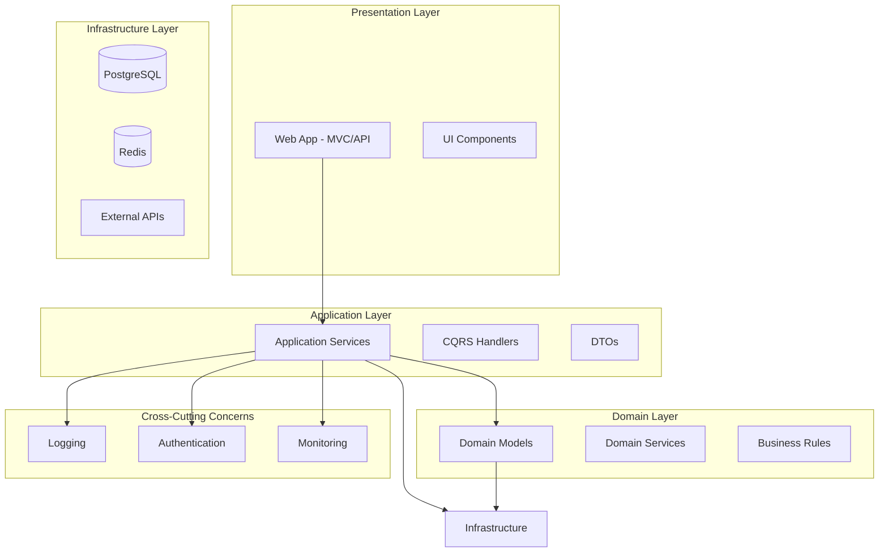

# Анализ архитектуры AnotherNewsPlatform

## Обзор проекта
**AnotherNewsPlatform** - агрегатор новостей с ранжированием по позитивности на основе .NET 10.0, ASP.NET Core MVC, Entity Framework Core (PostgreSQL) и .NET Aspire.

## Текущая архитектура

### Слои проекта:
1. **AnotherNewsPlatform.App** - Веб-приложение (ASP.NET Core MVC)
2. **AnotherNewsPlatform.Core** - Общие DTO и утилиты
3. **AnotherNewsPlatform.DataAccess** - Доступ к данным (EF Core + PostgreSQL)
4. **AnotherNewsPlatform.Services.ArticleService** - Бизнес-логика (сервис новостей)
5. **AnotherNewsPlatform.ServiceDefaults** - Конфигурация .NET Aspire
6. **AnotherNewsPlatform.AppHost** - Хост для .NET Aspire

### Технологический стек:
- .NET 10.0
- ASP.NET Core MVC
- Entity Framework Core 10.0.5
- PostgreSQL (Npgsql)
- .NET Aspire
- HTML Agility Pack (для парсинга)
- OpenTelemetry (мониторинг)

## Выявленные проблемы архитектуры

### 1. **Нарушение принципов чистой архитектуры**
- Сервисный слой напрямую зависит от DataAccess (DbContext)
- DTO находятся в Core, но используются сервисом и контроллерами
- Отсутствует четкое разделение ответственности

### 2. **Проблемы с именованием и организацией**
- Проект `AnotherNewsPlatform.Services.ArticleService` содержит файл `AnotherNewsPlatform.NewsService.csproj`
- DTO `NewsDto` находится в пространстве имен `AnotherNewsPlatform.NewsService`, но физически в Core
- Класс `NewsService` имеет неполную реализацию метода `AggregateNews`

### 3. **Проблемы с базой данных**
- В сущности `News` отсутствует поле `Text`, но оно есть в `NewsDto`
- Закомментированные связи (Author, Category) создают путаницу
- DataAccess проект имеет `OutputType: Exe`, что необычно для слоя доступа к данным

### 4. **Недостаточное использование .NET Aspire**
- AppHost содержит только одно приложение
- Не используются ресурсы (база данных, кэш, очереди)
- ServiceDefaults подключены, но не все возможности используются

### 5. **Проблемы с бизнес-логикой**
- Метод `AggregateNews` не реализован полностью
- Отсутствует обработка ошибок и логирование
- Нет механизма ранжирования по позитивности (основная фича проекта)

### 6. **Веб-слой**
- Контроллеры минимальны, отсутствует полноценный CRUD
- Нет аутентификации/авторизации
- Views используют устаревший подход (без компонентов)

## Предлагаемые улучшения

### 1. **Рефакторинг структуры проекта**
```
AnotherNewsPlatform/
├── src/
│   ├── AnotherNewsPlatform.Web/          # Веб-приложение (MVC/API)
│   ├── AnotherNewsPlatform.Application/  # Сценарии использования
│   ├── AnotherNewsPlatform.Domain/       # Доменная модель
│   ├── AnotherNewsPlatform.Infrastructure/# Инфраструктура (DataAccess)
│   └── AnotherNewsPlatform.Shared/       # Общие компоненты
├── tests/
│   ├── UnitTests/
│   └── IntegrationTests/
└── aspire/
    ├── AppHost/
    └── ServiceDefaults/
```

### 2. **Внедрение Clean Architecture**
- Разделить зависимости: Domain → Application → Infrastructure → Web
- Использовать MediatR для CQRS
- Внедрить AutoMapper для маппинга DTO

### 3. **Улучшение слоя данных**
- Вынести миграции в отдельный проект
- Добавить репозитории/Unit of Work
- Реализовать кэширование
- Добавить индексы для производительности

### 4. **Реализация основной функциональности**
- Завершить метод `AggregateNews` с RSS парсингом
- Добавить анализ тональности текста (sentiment analysis)
- Реализовать систему рейтингов и фильтрации
- Добавить фоновые задачи (BackgroundService)

### 5. **Улучшение веб-слоя**
- Добавить API endpoints (REST/GraphQL)
- Реализовать аутентификацию (JWT/Identity)
- Добавить Swagger/OpenAPI документацию
- Внедрить фронтенд фреймворк (React/Vue/Angular) или использовать Razor Pages

### 6. **Расширение .NET Aspire**
- Добавить PostgreSQL как ресурс AppHost
- Внедрить Redis для кэширования
- Добавить мониторинг (Grafana, Prometheus)
- Настроить health checks

### 7. **Качество кода и тестирование**
- Добавить unit и integration tests
- Внедрить CI/CD pipeline
- Добавить статический анализ кода
- Реализовать логирование (Serilog/Application Insights)

## Приоритеты реализации

### Высокий приоритет:
1. Рефакторинг структуры проекта
2. Завершение метода AggregateNews
3. Добавление анализа тональности
4. Реализация базового CRUD для новостей

### Средний приоритет:
1. Внедрение Clean Architecture
2. Добавление аутентификации
3. Настройка .NET Aspire ресурсов
4. Создание тестов

### Низкий приоритет:
1. Оптимизация производительности
2. Расширенный мониторинг
3. Многопользовательские функции
4. Мобильное приложение

## Диаграмма целевой архитектуры



## Следующие шаги

1. **Создать детальный план миграции** на новую архитектуру
2. **Начать с рефакторинга DataAccess** в Infrastructure слой
3. **Реализовать анализ тональности** как основную фичу
4. **Добавить базовую аутентификацию** для пользователей
5. **Расширить .NET Aspire** конфигурацию

## Риски и ограничения

- **Время миграции**: Рефакторинг может занять значительное время
- **Совместимость**: Необходимо обеспечить обратную совместимость
- **Обучение команды**: Новая архитектура требует обучения
- **Производительность**: Сложная архитектура может повлиять на производительность

## Заключение

Проект имеет хорошую основу с современным стеком технологий (.NET 10, Aspire), но требует значительного рефакторинга для улучшения архитектуры и реализации заявленной функциональности. Рекомендуется поэтапный подход к улучшениям, начиная с наиболее критичных проблем.